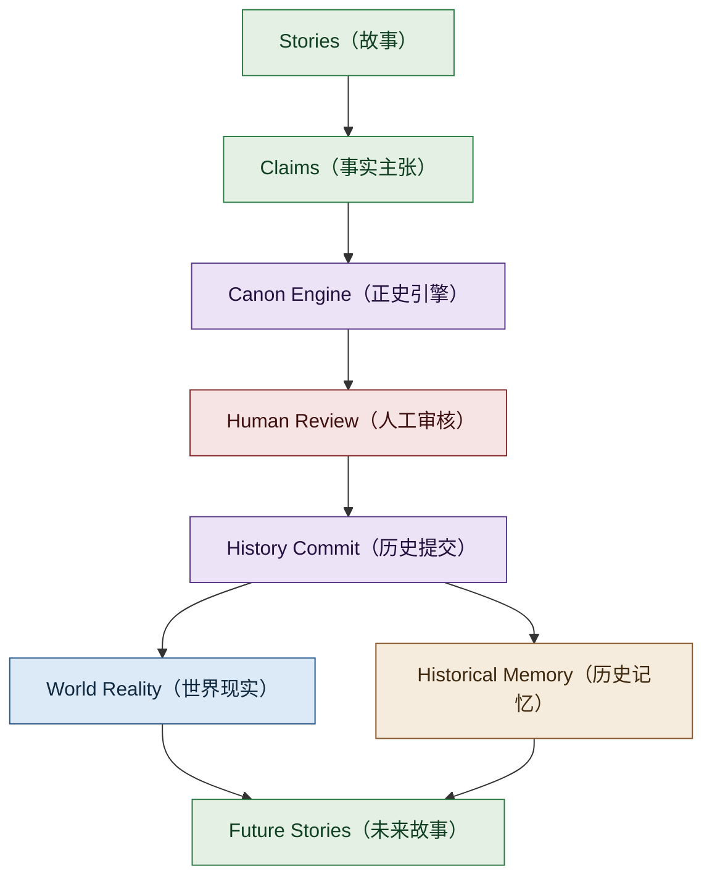
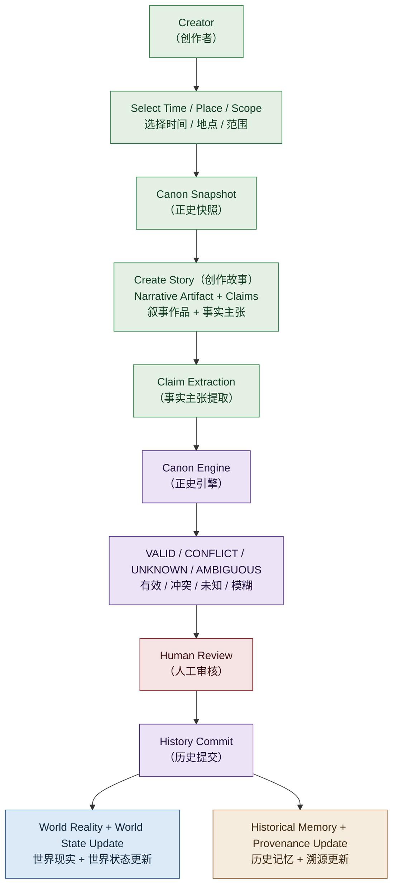

# Living Universe（活宇宙）

> **Living Universe（活宇宙）is a persistent narrative civilization（持续叙事文明）where stories propose facts, facts become history, and history permanently reshapes the world.**
>
> **中文：Living Universe 是一种由大量人类创作者共同创造、由 AI 基础设施维护的持续叙事文明。故事可以提出事实，事实可以进入历史，历史会产生后果；世界不仅保存真实发生过什么，也保存人们曾经如何记录、理解和误解这些历史。**

> Status: **v0.2 Documentation Architecture（文档架构阶段）** · 所有 AI、Knowledge Graph（知识图谱）、Canon Engine（正史引擎）、Simulation（模拟）相关内容均为 **Architecture Direction（架构方向）**，不代表已经实现。

---

## Not a Novel Site, But a Civilization（不是小说网站，而是持续文明）

| 它不是（It is not） | 它是（It is） |
| --- | --- |
| 小说网站（novel site）——没有"完结"，合上书世界就停止 | 持续叙事文明（persistent narrative civilization）——世界持续存在，故事只是历史发生的方式 |
| AI 小说生成器（AI story generator）——AI 代替创作 | AI 负责一致性治理（consistency governance），人类保留创作与最终裁定 |
| 协作写作网站（collaborative writing platform）——没有正史，越写越乱 | 有共享正史（Living Canon）、世界状态（World State）与历史提交（History Commit），长期保持一致 |
| 世界观 Wiki（worldbuilding wiki）——只记录世界 | 故事会**改变**世界：Story（故事）→ Claims（事实主张）→ Validation（验证）→ History（历史） |

---

## 30-Second Overview（30 秒看懂）

> **创作者写故事 → 系统提取事实 → 正史引擎检查 → 人类决定 → 历史进入世界。**



**四个要点：**

- **The universe is the product. Stories are how history happens.** —— 宇宙本身是第一产品，故事是历史发生的方式。
- **Story（故事） ≠ Truth（真相）** —— 故事提出 Claims（事实主张），只有验证后的一部分才进入 Reality Canon（现实正史）。
- **Canon facts may change. Canon artifacts remain.** —— 正史事实可以被重新认识（Canon Reframing 正史重构），但历史作品本身继续存在。
- **AI asks: Can it exist? Humans decide: Should it become history?** —— AI 判断"它能不能成立"，人类决定"它值不值得成为历史"。

传统小说世界随作品结束而停止，多人在线协作又难以维持长期一致性；Living Universe 探索的是：AI 时代，大规模多人共同维护一个具有长期历史连续性的虚构文明。

---

## Creation Pipeline（创作流水线）

> **一篇故事如何成为历史：**



> **UNKNOWN（未知） ≠ FALSE（错误）** —— 未定义 ≠ 错误；创作者仍可在 Canon White Space（正史空白区）提出新主张。
> 完整版（含 CONFLICT / AMBIGUOUS 的修改回路与判定说明）见 [Architecture Atlas · 02 Creation Pipeline](docs/visuals/creation-pipeline.md)。

---

## Core Systems（核心系统）

**六个核心组件（Six Core Components）：**

| 组件 | 一句话说明 |
| --- | --- |
| Living Canon（活正史） | 持续增长和变化的共享正史（Reality Canon 现实正史 + Historical Record Layer 历史记录层） |
| World State（世界状态） | 世界的可变化状态；某一时间点的完整状态为 World Snapshot（世界快照） |
| Canon Compiler（正史编译器） | 检查故事与世界一致性的工具方向；是 Canon Engine（正史引擎）的组成部分 |
| Creator Participation（创作者参与） | 多创作者共同参与，Creator Ownership（创作者所有权）受到保护 |
| History Commit（历史提交） | 故事正式成为历史的有记录、可追溯操作 |
| Reference Universe（参照宇宙） | 验证框架的示范宇宙（Reference Universe Alpha） |

**五个最高层核心概念：** World Reality（世界现实）、World State（世界状态）、Historical Memory（历史记忆）、Creator Ecosystem（创作者生态）、Canon Engine（正史引擎）—— 见 [01 System Landscape 系统全景图](docs/visuals/system-landscape.md)。

---

## Go Deeper（深入阅读）

| 文档 | 内容 |
| --- | --- |
| [docs/SYSTEM_OVERVIEW.md](docs/SYSTEM_OVERVIEW.md) | 系统说明（v0.2 总入口） |
| [docs/architecture/system-v0.2.md](docs/architecture/system-v0.2.md) | v0.2 总体架构 |
| [GLOSSARY.md](GLOSSARY.md) | 术语表 |
| [PRINCIPLES.md](PRINCIPLES.md) | 原则 |
| [MANIFESTO.md](MANIFESTO.md) | 宣言（草案） |
| [WHITEPAPER.md](WHITEPAPER.md) | 白皮书（草案） |
| [ROADMAP.md](ROADMAP.md) | 路线图（草案） |
| [CHANGELOG.md](CHANGELOG.md) | 更新日志 |

---

## Architecture Atlas（架构图谱）

> **8 张 Mermaid 架构图，从系统全景到离线合并 —— 3 分钟看懂整个系统。**
> 入口：**[Living Universe Architecture Atlas（活宇宙架构图谱）](docs/visuals/README.md)** · 目录：[docs/visuals/](docs/visuals/)

| # | 图 | 用途 | 文件 |
| --- | --- | --- | --- |
| 01 | System Landscape（系统全景） | 看整个活宇宙由哪些核心系统构成 | [system-landscape.md](docs/visuals/system-landscape.md) |
| 02 | Creation Pipeline（创作流水线） | 看一篇故事如何成为历史 | [creation-pipeline.md](docs/visuals/creation-pipeline.md) |
| 03 | Historical Layers（历史分层） | 看真相、记录、宣传和传说如何并存 | [historical-layers.md](docs/visuals/historical-layers.md) |
| 04 | World Data Graph（世界数据图） | 看人物、地点、科技、事件如何连接 | [world-data-graph.md](docs/visuals/world-data-graph.md) |
| 05 | Canon Engine（正史引擎） | 看规则、图谱和 AI 如何一起工作 | [canon-engine.md](docs/visuals/canon-engine.md) |
| 06 | Governance & AI（治理与 AI） | 看机器与人类各自负责什么 | [governance-ai.md](docs/visuals/governance-ai.md) |
| 07 | Canon Reframing Flow（正史重构流程） | 看旧故事如何被重新解释而不是删除 | [canon-reframing.md](docs/visuals/canon-reframing.md) |
| 08 | Offline Merge Flow（离线合并流程） | 看多人离线创作与冲突如何合并 | [offline-merge.md](docs/visuals/offline-merge.md) |

---

## Evolution & Version Notes（演化与版本说明）

<details>
<summary>架构演化：v0.1 → v0.2（历史信息，非当前主线）</summary>

**v0.1（历史流程）：**

```text
创作者 → 创作故事 → Canon AI 一致性检查 → 人工 / 社区审核
→ History Commit → 进入 Living Canon → 修改 World State
→ 影响未来故事 → 世界持续演化
```

**v0.2 升级要点：**

- Story（故事）重新定义为 **Narrative Artifact（叙事作品）+ Claims（事实主张）+ Possible World-State Transactions（可能的世界状态变更）**
- 新增 Claim Layer（事实主张层）、Historical Record Layer（历史记录层）、Epistemic Layer（认知层）
- 新增 Canon Reframing（正史重构）、Canon Snapshot（正史快照）、Merge Conflict Model（合并冲突模型）
- 新增 Temporal / Causal / Provenance Graph（时间 / 因果 / 溯源图谱）概念
- 分离 World Reality（世界现实）与 Historical Records（历史记录）

</details>

## Repository Structure（目录结构）

```text
living-universe/
├── docs/          # 系统文档（含 visuals/ 架构图谱）
├── universe/      # 参照宇宙（Reference Universe Alpha）内容
├── stories/       # 故事（canon / soft-canon / sandbox）
└── prototypes/    # 原型（当前为空）
```
