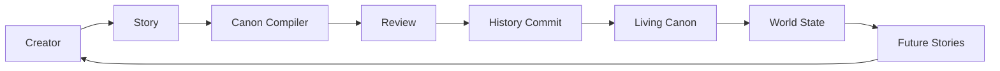

# Living Universe System Overview

## Version 0.2 Draft（由 v0.1 增量升级）

> 本文档是 Living Universe 框架的系统说明。当前版本为 v0.2 Draft，由 v0.1 增量升级而来；v0.1 内容保留在本文档中并标注为历史。
> 本文档定义概念、原则与方向；其中提到的所有技术能力均为方向性描述，不代表任何实现已经完成。
> 目前所有 AI、Knowledge Graph（知识图谱）、Canon Engine（正史引擎）、Simulation（模拟）相关内容仍属于 Architecture Direction（架构方向），不代表已经完成实现。

---

#  v0.2 升级说明

v0.1（旧架构）：

```text
Story
（故事）

↓

Canon Check
（正史检查）

↓

History Commit
（历史提交）

↓

World State
（世界状态）
```

v0.2（新架构）：

```text
Story
（故事）

↓

Narrative Artifact + Claims
（叙事作品 + 事实主张）

↓

Canon Engine
（正史引擎）

↓

Human Review
（人工审核）

↓

History Commit
（历史提交）

↓

World Reality
（世界现实）

+

World State
（世界状态）

+

Historical Records
（历史记录）

+

Provenance
（历史溯源）
```

v0.2 引入五个最高层核心概念：World Reality（世界现实）、World State（世界状态）、Historical Memory（历史记忆）、Creator Ecosystem（创作者生态）、Canon Engine（正史引擎）。

总体架构详见 [docs/architecture/system-v0.2.md](architecture/system-v0.2.md)。

---

# 1. Introduction

传统小说的世界通常随着作品结束而停止：读者合上书之后，世界不再发生任何事。

传统共享 IP（Shared IP）虽然拥有多个创作者，但正史（Canon）通常仍由中心化公司或少数作者控制，参与门槛高、演进空间有限。

普通协作写作（Collaborative Writing）允许很多人共同创作，却难以维持几千、几万个角色与历史事件之间的长期一致性。世界越大，矛盾越多，最终往往走向混乱或停滞。

AI 时代第一次让下面这件事在技术上具有现实可能性：

> **大规模多人共同维护一个具有长期记忆和历史连续性的虚构文明。**

Living Universe 尝试探索的正是这种新型叙事娱乐形式。

---

# 2. Definition of a Living Universe

v0.2 正式定义：

> **Living Universe（活宇宙） is a persistent narrative civilization（持续叙事文明） jointly created by multiple human creators（多个人类创作者） and supported by AI infrastructure（AI基础设施）, where stories can propose facts, facts can become history, history produces consequences, and the world preserves both reality and the records people made about reality.**

中文：

> **Living Universe（活宇宙）是一种由大量人类创作者共同创造、由 AI 基础设施维护的持续叙事文明。故事可以提出事实，事实可以进入历史，历史会产生后果，而世界不仅保存真实发生过什么，也保存人们曾经如何记录、理解和误解这些历史。**

强调：Living Universe 不只是 Shared Universe（共享宇宙），不只是 Collaborative Writing Platform（协作写作平台），更不是 AI Story Generator（AI故事生成器），而应逐渐定义为：

> **Persistent Narrative Civilization（持续叙事文明）**

v0.1 定义（历史，保留）：

> **A Living Universe is a persistent narrative civilization jointly created by humans and AI, where stories can become history and permanently modify a shared canonical world state.**

> **Living Universe 是一种由人类与 AI 共同创造、拥有持续世界状态与共享正史的虚拟文明；作品一旦进入正史，就会成为历史，并影响之后所有创作。**

Living Universe 至少拥有以下属性：

### Persistence（持续性）

世界不会因为一个故事结束而重置。

### Canon（正史）

存在所有参与者共同承认的历史事实。

### State（状态）

人物、国家、技术、地点和组织拥有可变化状态。

### Participation（参与性）

多个创作者能够共同贡献内容。

### Continuity（连续性）

后来的创作必须继承之前已经发生的历史。

---

# 3. Core Principle: Story as a World-State Transaction

v0.2 升级定义：

> **Story（故事） = Narrative Artifact（叙事作品） + Claims（事实主张） + Possible World-State Transactions（可能的世界状态变更）**

故事本身永远是一件独立存在的作品（Narrative Artifact）；故事中的某些内容提出关于世界的 Claims（事实主张）；Claims 经过 Canon Engine（正史引擎）检查和人工审核之后，其中一部分才会成为 Reality Canon（现实正史），并真正改变 World State（世界状态）。

v0.1 定义（历史，保留）：

> **Story = World-State Transaction**

故事不仅仅是文字内容。

一个进入正史的故事可能把世界状态从一种情况改变为另一种情况，例如：

```text
Character A
alive → dead

City B
independent → occupied

Country C
peace → war

Technology D
experimental → public

Organization E
active → dissolved
```

因此：

故事不仅描述世界。

故事会**改变世界**。

这是 Living Universe 与传统叙事最核心的区别：叙事行为本身是改变世界状态的操作。

---

# 4. Living Canon

> **Living Canon**

Living Canon 是一个持续增长和变化的共享正史。

传统正史：

```text
Author
↓
Story
↓
Canon
↓
Fixed
```

传统正史一旦确定就基本固定，后续作品只能在其内部创作。

Living Canon：

```text
World State v1
↓
New Story
↓
Canon Check
↓
History Commit
↓
World State v2
↓
Future Stories
↓
World State v3
↓
...
```

世界因此拥有真正的历史连续性：每一次正史变化都来自一次有记录、可追溯的提交（History Commit）。

v0.2 补充：Living Canon 进一步具体化为 Reality Canon（现实正史）+ Historical Record Layer（历史记录层）的组合：世界不仅保存认定的事实，也保存关于事实的记录。详见 [docs/architecture/living-canon.md](architecture/living-canon.md)。

---

# 5. Canon Hierarchy

Living Universe 的正史至少分为以下几个层级。

## Canon Constitution（正史宪法）

最高层规则。

包括：

- 基础物理规则
- 技术边界
- AI 基本定义
- 宇宙中的关键不可变原则

普通创作者不能随意修改。

## Hard Canon（硬正史）

已经确认的重大历史事实。

例如：

- 国家成立
- 战争发生
- 重大技术突破
- 政权更替

## Local Canon（局部正史）

地区、城市、组织或局部时间范围内的正史。

## Personal Canon（个人正史）

创作者自己创建角色的核心人生历史。

## Sandbox / Apocrypha（沙盒 / 外典）

实验作品、候选作品、平行版本以及尚未进入正式正史的内容。

> v0.2 更新：上述五层级模型在 v0.2 中被拆分为三个独立维度——Canon Authority（正史权威等级）、Scope（作用范围）、Creator Ownership（创作者所有权），并引入 Impact Level（影响等级 S0–S5）决定治理强度。详见 [docs/governance/canon-levels.md](governance/canon-levels.md)。

---

# 6. Creator Model

Living Universe 不采用"所有角色完全属于平台"的模式。

核心思想是：

> **开放世界，但保护创作者。**

角色权利至少分为：

### Creator Ownership（创作者所有权）

原始创作者保持：

- 创作者署名
- 人物核心设定的创作身份
- 与商业化相关的潜在权益

### Canon Usage（正史使用权）

其他作者在规则允许或获得授权的情况下，可以：

- 客串角色
- 与角色互动
- 在公共事件中使用角色

### Historical Reference（历史引用权）

已经成为公共正史的历史事实，可以被其他作者正常引用。

例如：如果某人物曾经担任总统，那么其他作品可以写：

"这座建筑建于 X 总统执政时期。"

而无需重新取得修改该角色的完整权利。

> 注：以上为概念框架，不是法律条款。具体规则见 `docs/governance/creator-rights.md`（当前为草案状态）。

---

# 7. History Commit

> **History Commit**

这是 Living Universe 中非常重要的操作。

类似软件开发中的：

```text
Code
→ Review
→ Merge
```

Living Universe 使用：

```text
Story
→ Canon Check
→ Review
→ History Commit
```

History Commit 表示：

> 一个故事或事件正式成为这个宇宙的历史。

必须能够记录：

- 作者
- 时间
- 版本
- 被修改的实体
- 新增历史事实
- 被影响的后续 Canon
- 审核记录

未来所有 History Commit 都应该具有可追溯性（Traceability）。

v0.2 更新：History Commit 不仅修改 World State（世界状态），还需要更新：

- Reality Canon（现实正史）
- Historical Record Layer（历史记录层）
- Provenance Graph（溯源图谱）
- Causal Graph（因果图谱）
- Claim Status（主张状态）
- Blast Radius Index（影响范围索引）

---

# 8. Canon Compiler

Canon Compiler（正史编译器）是 Living Universe 的核心技术方向之一。

其目标不是替作者写故事，而是：

> **像程序编译器检查代码一样检查故事与世界是否兼容。**

例如作者写：

"3127 年主人公驾驶曲率飞船离开火星。"

但 Canon 数据显示：

"曲率引擎直到 3159 年才出现。"

Canon Compiler 应输出类似：

```text
CANON CONFLICT

Type:
Technology / Timeline

Story:
Warp spacecraft used in 3127.

Canon:
First operational warp engine: 3159.

Suggested resolution:
Use an existing propulsion technology
or modify the event date.
```

未来需要检查：

- 时间线
- 科技
- 地理
- 人物年龄
- 人物关系
- 组织状态
- 国家状态
- 历史因果
- 资源约束
- 世界基本规则

> 注：Canon Compiler 当前为概念定义阶段，尚未实现。

v0.2 更新：Canon Compiler（正史编译器）只是 Canon Engine（正史引擎）的一部分。Canon Engine 还包含实体解析、身份碰撞检测、并发主张检测、影响范围分析、认知状态分析等检查器。详见 [docs/architecture/canon-engine.md](architecture/canon-engine.md)。

---

# 9. AI Architecture

不要把所有 AI 功能塞进一个 AI。

目前规划四类 AI。

v0.2 职责更新：

- **Canon AI（正史 AI）**：负责 Consistency（世界一致性）、Conflict Detection（冲突检测）、Claim Analysis（事实主张分析）；定位是 Semantic Validator（语义验证器），不是创作主脑、宇宙上帝或最终裁决者。
- **Historian AI（史官 AI）**：负责 Historical Records（历史记录）、Source Comparison（史料比较）、Historiography（历史解释演化）；区分 Fact（事实）、Record（记录）、Belief（认知）、Propaganda（宣传）、Rumor（谣言）。
- **Curator AI（策展 AI）**：负责 Reading Path（阅读路径）、World Exploration（世界探索）、Historical Discovery（历史发现）、Canon White Space Discovery（正史空白发现）。
- **Simulation AI（模拟 AI）**：远期负责 Population / Economic / Political / Social Simulation（人口 / 经济 / 政治 / 社会模拟）与 Technology Diffusion（科技扩散）；必须定义为 Possible Futures Generator（可能未来生成器），而不是 Reality Predictor（现实预测器）。

## Canon AI（正史 AI）

负责世界一致性。

原则：

> **AI determines whether something can exist.**

AI 判断"这个东西能不能在这个世界存在"，不决定"这个故事值不值得进入这个世界"。

## Curator AI（策展 AI）

负责：

- 推荐故事
- 推荐阅读路径
- 内容分类
- 帮助发现值得创作的历史空白

## Historian AI（史官 AI）

负责：

- 阅读整个正史
- 总结文明趋势
- 描述世界变化
- 生成历史回顾

## Simulation AI（模拟 AI）

远期功能。

负责：

- 多 Agent 社会
- 文明模拟
- 制度实验
- 未来可能性探索

> 当前阶段不要实现 Simulation AI。

---

# 10. Governance Model

不能采用完全中心化，也不能采用完全无审核开放。

建议的通用流程：

```text
Creator
↓
Story
↓
Canon AI
↓
Human Review
↓
Community Feedback
↓
History Commit
```

不同重要程度作品采用不同治理强度。

普通小人物故事：

```text
AI Check
+
Editor Review
```

地方事件：

```text
AI
+
Editor
+
Community Feedback
```

重大历史事件：

```text
Multiple Proposals
+
Canon Validation
+
Editorial Review
+
Community Discussion
+
Final Canon Decision
```

注意：

不能简单采用：

> 票数最高 = 正史。

避免整个世界被爽点、战争和流行趋势绑架。

v0.2 更新：治理按 Impact Level（影响等级）划分：S0 Background（背景级）、S1 Local（地方级）、S2 Regional（区域级）、S3 National（国家级）、S4 Civilization（文明级）、S5 Constitutional（正史宪法级）。影响越高，审核越严格。详见 [docs/governance/canon-levels.md](governance/canon-levels.md)。

---

# 11. Reference Universe

Living Universe Framework 与第一个科幻世界必须明确区分。

## Living Universe

是一套：

> framework / narrative paradigm

即框架与叙事范式本身。

## Reference Universe Alpha（参照宇宙 Alpha）

是：

> 第一个验证 Living Universe 是否可行的示范宇宙。

目前 Reference Universe 的基本方向：

- 时间约为公元 3000 年左右
- 硬科幻倾向
- AI 与人类文明关系
- 星际扩张
- 政治与社会演化
- 技术发展
- 普通人的生活
- 大历史通过大量小人物故事逐渐呈现

现在不要设计完整数千年历史。

第一阶段只需要建立：

- 一个主要时间段
- 一个核心地点
- 三个左右主要势力
- 少量核心科技
- 一个核心文明矛盾
- 第一批短篇故事

---

# 12. Narrative Experience

用户进入 Living Universe 后，不应该只看到"最新小说列表"。

长期理想体验更类似：

```text
Current Date: 3127-06-17

World News

New Canon Events

Featured Characters

Historical Archives

Current Political Situation

Technology Changes

New Stories

Open Historical Questions
```

用户应该逐渐产生：

"我不是在阅读一本小说。"

而是：

> **"我正在观察另一个真正持续存在的世界。"**

---

# 13. Long-Term Evolution

项目分成三个长期阶段。

## Stage 1 — Living Story

目标：建立新的娱乐体验。

媒介包括：

- 小说
- AI 漫画
- 视频
- 角色互动
- 虚构新闻

## Stage 2 — Living Universe

建立：

- World State
- Living Canon
- Creator Community
- Canon Compiler
- History Commit
- Persistent History

## Stage 3 — Civilization Wind Tunnel（文明风洞）

远期探索：

- 真人 + AI Agent 共存
- 多社会模型模拟
- 虚拟文明实验
- 制度与技术思想实验
- 从虚拟文明中生成现实研究假设

必须注明：

> Civilization Wind Tunnel 当前只是长期研究方向。

不要宣传为"能够准确预测现实社会"。

更加严谨的定位是：

> **Explore possible futures rather than predict a single future.**

---

# 14. Core System Loop



---

# 15. System Architecture（v0.1 结构；v0.2 结构见 §19 与 system-v0.2.md）

```mermaid
flowchart TD
    A[Living Universe]

    A --> B[Framework]
    B --> B1[Manifesto]
    B --> B2[Whitepaper]
    B --> B3[Glossary]
    B --> B4[Principles]

    A --> C[Platform]
    C --> C1[Creator System]
    C --> C2[Story Submission]
    C --> C3[Canon Compiler]
    C --> C4[History Commit]
    C --> C5[World State]

    A --> D[Reference Universe]
    D --> D1[Timeline]
    D --> D2[Characters]
    D --> D3[Locations]
    D --> D4[Factions]
    D --> D5[Stories]

    A --> E[Governance]
    E --> E1[Canon Constitution]
    E --> E2[Hard Canon]
    E --> E3[Local Canon]
    E --> E4[Personal Canon]
    E --> E5[Sandbox]

    A --> F[AI Layer]
    F --> F1[Canon AI]
    F --> F2[Curator AI]
    F --> F3[Historian AI]
    F --> F4[Simulation AI]
```



---

# 16. Six Core Components

Living Universe 当前最重要的六个组成部分：

1. **Living Canon** — 持续增长和变化的共享正史
2. **World State** — 世界的可变化状态
3. **Canon Compiler** — 检查故事与世界一致性的工具方向
4. **Creator Participation** — 多创作者共同参与
5. **History Commit** — 故事正式成为历史的有记录操作
6. **Reference Universe** — 验证框架的示范宇宙

如果未来概念不断扩张，所有新增功能都应该回答一个问题：

> **它是否加强了这六个核心组件之一？**

否则不应该过早加入项目。

v0.2 补充：v0.2 新增的 Claims（事实主张）、Historical Records（历史记录）、Epistemic Layer（认知层）等概念服务于同一检验标准——它们分别加强了 Living Canon（通过 Reality Canon 与 Historical Record Layer）与 Canon Compiler（通过 Canon Engine）等组件。

---

# 17. Project Principles

## Principle 1

**The universe is the primary product.**

宇宙本身是第一产品。

## Principle 2

**Stories create history.**

故事创造历史。

## Principle 3

**AI assists consistency governance; final canonical authority remains human-governed.**

AI 辅助一致性治理，最终正史裁定权仍由人类掌握。

v0.1 表述（历史）：AI governs consistency, not creativity.（AI 管理一致性，而不是创造力。）

中文解释：

AI 负责：

> "这个东西能不能在这个世界存在？"

人类负责：

> "这个故事值不值得进入这个世界？"

## Principle 4

**Creators retain authorship.**

创作者保留署名权。

## Principle 5

**No single author owns history.**

没有任何单一作者拥有历史。

## Principle 6

**Canon must remain traceable.**

正史必须可追溯。

所有重大正史变化都必须能够追踪来源。

---

# 18. Current Project Scope

## 当前阶段不做（v0.1 沿用，v0.2 继续遵守）

- 大规模 Agent 文明
- 自研基础模型
- 完整商业平台
- 区块链
- Token
- DAO
- NFT
- 复杂实时 3D 世界
- 完整 IP 自动结算系统
- 社会预测产品

## 当前只验证

### Hypothesis A

人们是否愿意让自己创造的角色进入一个共同世界？

### Hypothesis B

故事进入正史并永久影响世界，是否具有吸引力？

### Hypothesis C

AI 是否能够有效帮助维护多人世界的一致性？

---

# 19. v0.2 新增系统（概览）

v0.2 在 v0.1 基础上新增以下系统概念，详细定义见 [docs/architecture/system-v0.2.md](architecture/system-v0.2.md) 与各子系统文档：

| 系统 | 一句话定义 | 文档 |
| --- | --- | --- |
| World Reality（世界现实） | 当前认定真正发生过的事情 | [world-reality.md](architecture/world-reality.md) |
| Claim Layer（事实主张层） | 故事与真相之间的中间层 | [claim-layer.md](architecture/claim-layer.md) |
| Canon Engine（正史引擎） | 验证主张与正史兼容性的引擎 | [canon-engine.md](architecture/canon-engine.md) |
| Canon Snapshot（正史快照） | 按时间 / 地点 / 范围给创作者的正史摘要 | [canon-snapshot.md](architecture/canon-snapshot.md) |
| Canon White Space（正史空白区） | 世界保留的未知与开放区域 | [canon-white-space.md](architecture/canon-white-space.md) |
| Historical Record Layer（历史记录层） | 世界内部产生的所有记录 | [historical-record-layer.md](architecture/historical-record-layer.md) |
| Epistemic Layer（认知层） | 知识的状态：真实 / 错误 / 未知 / 争议 / 宣传等 | [epistemic-layer.md](architecture/epistemic-layer.md) |
| Canon Reframing（正史重构） | 旧故事继续存在，意义可以改变 | [canon-reframing.md](architecture/canon-reframing.md) |
| Temporal Knowledge Graph（时间知识图谱） | 实体 × 关系 × 时间 × 状态的数据结构 | [temporal-knowledge-graph.md](architecture/temporal-knowledge-graph.md) |
| Causal Graph（因果图谱） | 事件之间的因果网络 | [causal-graph.md](architecture/causal-graph.md) |
| Provenance Graph（溯源图谱） | 事实的来源与变化历史 | [provenance-graph.md](architecture/provenance-graph.md) |
| Merge Protocol（合并协议） | 并发主张冲突的处理规则 | [merge-protocol.md](architecture/merge-protocol.md) |
| Identity System（身份系统） | 名字不能作为唯一标识 | [identity-system.md](architecture/identity-system.md) |
| Blast Radius（影响范围） | 正史修改的影响评估 | [blast-radius.md](architecture/blast-radius.md) |

---

## 文档状态

本文档为 v0.2 Draft（由 v0.1 增量升级），将随框架演进持续更新。

相关文档索引：

- `README.md`
- `MANIFESTO.md`（草案）
- `WHITEPAPER.md`（草案）
- `GLOSSARY.md`
- `PRINCIPLES.md`
- `ROADMAP.md`（草案）
- `CHANGELOG.md`
- [docs/architecture/system-v0.2.md](architecture/system-v0.2.md)（v0.2 总体架构）
