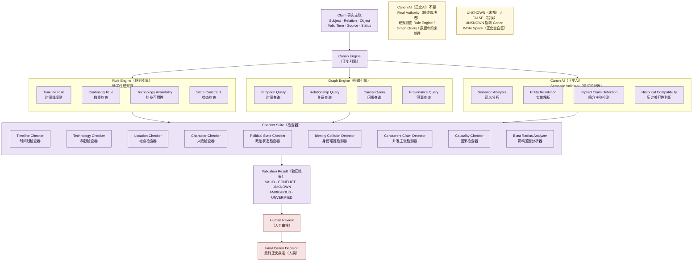

# 05 · Canon Engine Architecture（正史引擎架构图）

> 对应架构版本：仓库当前文档 v0.2 Draft。图中所有系统均为 **Architecture Direction（架构方向）**，不代表已经实现。

## 图用途（Purpose）

回答一个问题：

> **Canon Engine（正史引擎）到底是一个什么系统？**

关键：**Canon Engine（正史引擎）≠ Canon AI（正史AI）**。Canon AI（正史AI）只是引擎中的一个组成部分。规则（Rule Engine 规则引擎）、图谱查询（Graph Engine 图谱引擎）与 AI 语义验证（Canon AI 正史AI）三者组合，共同产出结构化验证结果。

## Mermaid Diagram

## 简短解释（Short Explanation）

- **输入**：结构化 Claim（事实主张）：Subject（主体）/ Relation（关系）/ Object（对象）/ Valid Time（有效时间）/ Source（来源）/ Status（状态）。
- **Rule Engine（规则引擎）**负责确定性硬规则：Timeline Rule（时间线规则）、Cardinality Rule（数量约束，如 `MAYOR_OF 最大同时数量 = 1`）、Technology Availability（科技可用性）、State Constraint（状态约束）。
- **Graph Engine（图谱引擎）**提供 Temporal Query（时间查询）、Relationship Query（关系查询）、Causal Query（因果查询）、Provenance Query（溯源查询）。
- **Canon AI（正史AI）**是 Semantic Validator（语义验证器）：Semantic Analysis（语义分析）、Entity Resolution（实体解析）、Implied Claim Detection（隐含主张检测）、Historical Compatibility（历史兼容性判断）。
- **Checker Suite（检查器）**：Timeline / Technology / Location / Character / Political State Checker、Identity Collision Detector（身份碰撞检测器）、Concurrent Claim Detector（并发主张检测器）、Causality Checker（因果检查器）、Blast Radius Analyzer（影响范围分析器）。文档中还包含 Entity Resolver（实体解析器）、Relationship Checker（关系检查器）、Historical Compatibility Checker（历史兼容性检查器）、Epistemic Analyzer（认知状态分析器）；Canon Compiler（正史编译器）是引擎中负责"像编译器检查代码一样检查故事"的组成部分。
- **输出**：Validation Result（验证结果）——VALID（有效）/ CONFLICT（冲突）/ UNKNOWN（未知）/ AMBIGUOUS（模糊）/ UNVERIFIED（未验证）。**UNKNOWN 不是 FALSE**，它指向正史空白区。
- **最终裁决在人类**：Canon AI（正史AI）不创造真相、不做最终裁决；Human Review（人工审核）之后才发生 History Commit（历史提交）。

## 对应架构文档（Related Architecture Docs）

- [docs/architecture/canon-engine.md](../architecture/canon-engine.md) — 引擎组成、Relation Constraints（关系约束）、验证结果
- [docs/architecture/canon-compiler.md](../architecture/canon-compiler.md) — Canon Compiler 是引擎的一部分
- [docs/architecture/identity-system.md](../architecture/identity-system.md) — Identity Collision Detector
- [docs/architecture/merge-protocol.md](../architecture/merge-protocol.md) — Concurrent Claim Detector 与 Relation Constraints
- [docs/architecture/blast-radius.md](../architecture/blast-radius.md) — Blast Radius Analyzer
- [docs/architecture/epistemic-layer.md](../architecture/epistemic-layer.md) — Epistemic Analyzer（认知状态分析器）
- [docs/architecture/canon-white-space.md](../architecture/canon-white-space.md) — UNKNOWN ≠ FALSE
