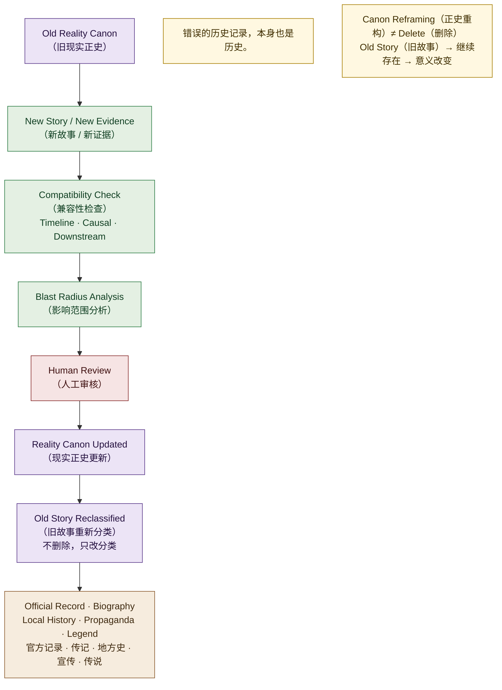

# 07 · Canon Reframing Flow（正史重构流程图）

> 对应架构版本：仓库当前文档 v0.2 Draft。图中所有系统均为 **Architecture Direction（架构方向）**，不代表已经实现。

## 图用途（Purpose）

回答一个问题：

> **当更好的解释出现时，旧故事如何被重新解释，而不是被删除？**

Canon Reframing（正史重构 / 再语境化）是 Living Universe（活宇宙）最重要的机制之一：旧正史内容过时、剧情老套、或新作品提供更好的解释时，世界吸收新解释，但旧作品继续存在。

## Mermaid Diagram

## 简短解释（Short Explanation）

1. **Old Reality Canon（旧现实正史）**：原先认定的事实，例如"2217 年 Dawn（曙光号）爆炸原因是反应堆故障"。
2. **New Story / New Evidence（新故事 / 新证据）**：新作品提出更合理的解释，例如真实原因是政治暗杀。
3. **Compatibility Check（兼容性检查）**：新主张必须满足 Timeline Compatibility（时间线兼容）、Causal Compatibility（因果兼容）、Downstream Compatibility（后续历史兼容），并有明显的 Narrative Gain（叙事价值提升）。
4. **Blast Radius Analysis（影响范围分析）**：计算这次重构会影响多少实体、故事、组织与未来事件。
5. **Human Review（人工审核）**：通过后才执行。
6. **Reality Canon Updated（现实正史更新）**：新解释成为新的 Reality Canon（现实正史）。
7. **Old Story Reclassified（旧故事重新分类）**：旧作品不删除，重新分类为 Official Record（官方记录）/ Biography（传记）/ Local History（地方历史）/ Propaganda（政治宣传）/ Historical Interpretation（历史解释）等。
8. **记住核心原则**：`Canon facts may change. Canon artifacts remain.`（正史事实可以被重新认识，但历史作品本身继续存在。）**错误的历史记录，本身也是历史。**

## 对应架构文档（Related Architecture Docs）

- [docs/architecture/canon-reframing.md](../architecture/canon-reframing.md) — 触发条件、重新分类、示例
- [docs/architecture/blast-radius.md](../architecture/blast-radius.md) — 重构前的影响范围分析
- [docs/architecture/historical-record-layer.md](../architecture/historical-record-layer.md) — 旧正史重新分类为记录
- [docs/architecture/provenance-graph.md](../architecture/provenance-graph.md) — 每次重构在溯源图中留痕
- [docs/architecture/world-reality.md](../architecture/world-reality.md) — Reality Canon（现实正史）
