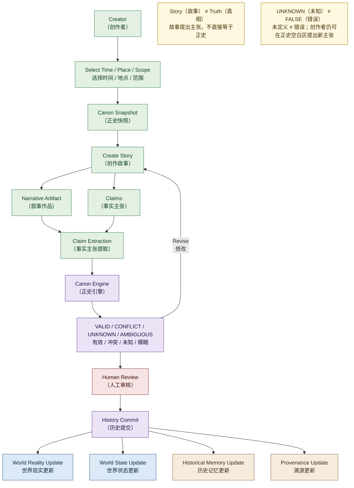

# 02 · Creation Pipeline（创作流水线）

> 对应架构版本：仓库当前文档 v0.2 Draft。图中所有系统均为 **Architecture Direction（架构方向）**，不代表已经实现。

## 图用途（Purpose）

回答一个问题：

> **一篇新故事如何进入 Living Universe（活宇宙）？**

这张图展示一条故事从创作者到历史的完整路径，并反复强调核心区分：

> **Story（故事） ≠ Truth（真相）**
> **Story（故事） → Claims（事实主张） → Validation（验证） → History（历史）**

## Mermaid Diagram

## 简短解释（Short Explanation）

1. **Creator（创作者）** 先选择 **Time / Place / Scope（时间 / 地点 / 范围）**，系统据此给出 **Canon Snapshot（正史快照）**，作为创作的基线（baseline），也支持离线创作。
2. **Create Story（创作故事）** 产出两部分：**Narrative Artifact（叙事作品）**（独立作品，永远存在）与 **Claims（事实主张）**（关于世界的断言）。
3. **Claim Extraction（事实主张提取）** 把作品中的断言转换为结构化事实主张：Subject（主体）/ Relation（关系）/ Object（对象）/ Valid Time（有效时间）/ Source（来源）/ Status（状态）。
4. **Canon Engine（正史引擎）** 输出验证结果：**VALID（有效）/ CONFLICT（冲突）/ UNKNOWN（未知）/ AMBIGUOUS（模糊）**（另有 UNVERIFIED 未验证，见正史引擎图）。
5. **Human Review（人工审核）** 由人类决定主张是否值得成为历史——AI 只判断"能不能成立"，不决定"值不值得"。
6. **History Commit（历史提交）** 同时更新：World Reality（世界现实）、World State（世界状态）、Historical Memory（历史记忆，含历史记录与认知层）、Provenance（溯源）。
7. 冲突或模糊的结果会回到创作者（Revise 修改），而不是直接进入正史；**UNKNOWN（未知）不是错误**，它指向 Canon White Space（正史空白区）。

## 对应架构文档（Related Architecture Docs）

- [docs/architecture/system-v0.2.md](../architecture/system-v0.2.md) — 完整创作流程（§ Example）
- [docs/architecture/claim-layer.md](../architecture/claim-layer.md) — Claim 结构与生命周期
- [docs/architecture/canon-snapshot.md](../architecture/canon-snapshot.md)
- [docs/architecture/canon-engine.md](../architecture/canon-engine.md)
- [docs/architecture/canon-white-space.md](../architecture/canon-white-space.md)
- [docs/SYSTEM_OVERVIEW.md](../SYSTEM_OVERVIEW.md#7-history-commit)
