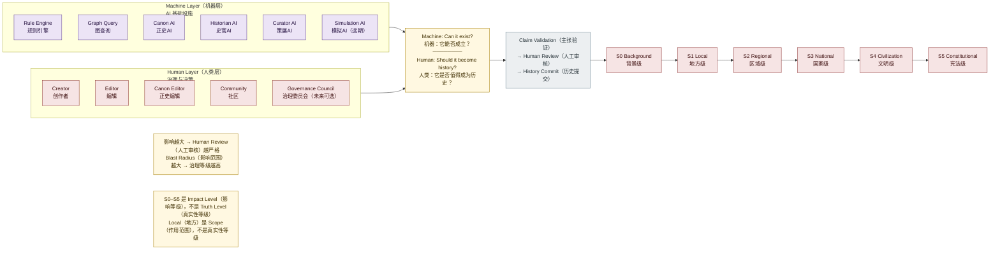

# 06 · Governance & AI Map（治理与 AI 架构图）

> 对应架构版本：仓库当前文档 v0.2 Draft。图中所有系统均为 **Architecture Direction（架构方向）**，不代表已经实现。

## 图用途（Purpose）

回答一个问题：

> **AI 和人到底分别负责什么？**

这张图用左右结构明确分工：左边是 Machine Layer（机器层），右边是 Human Layer（人类层），中间是分工原则。下图同时展示治理等级（Impact Level 影响等级）：影响越大，Human Review（人工审核）越严格。

## Mermaid Diagram

## 简短解释（Short Explanation）

- **Machine Layer（机器层）**负责"能不能成立"：
  - Rule Engine（规则引擎）与 Graph Query（图查询）处理确定性硬规则；
  - Canon AI（正史AI）是 Semantic Validator（语义验证器），负责一致性、冲突检测与事实主张分析；
  - Historian AI（史官AI）处理历史记录、史料比较与历史解释演化；
  - Curator AI（策展AI）负责阅读路径、世界探索与正史空白发现；
  - Simulation AI（模拟AI）是远期方向（Possible Futures Generator 可能未来生成器），当前不要实现。
- **Human Layer（人类层）**负责"值不值得成为历史"：Creator（创作者）、Editor（编辑）、Canon Editor（正史编辑）、Community（社区）、Governance Council（治理委员会，未来可选）。
- **中间的分工原则**：`AI 判断：Can it exist?（它能否成立？）`，`人类决定：Should it become history?（它是否值得成为历史？）`。
- **Impact Level（影响等级）**：S0 Background（背景级）→ S1 Local（地方级）→ S2 Regional（区域级）→ S3 National（国家级）→ S4 Civilization（文明级）→ S5 Constitutional（宪法级）。
- **影响越大，审核越严格**：普通小人物故事只需 AI Check + Editor Review；重大历史事件需要多提案、验证、编辑评审、社区讨论与最终正史裁定。
- **注意**：S0–S5 是 Impact Level（影响等级），不是 Truth Level（真实性等级）；Local（地方）是 Scope（作用范围），不是"更不真实"。
- 不采用"票数最高 = 正史"的规则，避免世界被流行趋势绑架。

## 对应架构文档（Related Architecture Docs）

- [docs/governance/canon-levels.md](../governance/canon-levels.md) — Impact Level S0–S5 与三维度模型
- [docs/governance/creator-rights.md](../governance/creator-rights.md) — Creator Ownership（创作者所有权）
- [docs/SYSTEM_OVERVIEW.md](../SYSTEM_OVERVIEW.md#9-ai-architecture) — 四类 AI 的职责
- [docs/SYSTEM_OVERVIEW.md](../SYSTEM_OVERVIEW.md#10-governance-model) — 治理流程
- [docs/architecture/blast-radius.md](../architecture/blast-radius.md) — 影响范围与治理等级的关系
- [docs/architecture/canon-engine.md](../architecture/canon-engine.md) — Canon AI 不是最终裁决者
