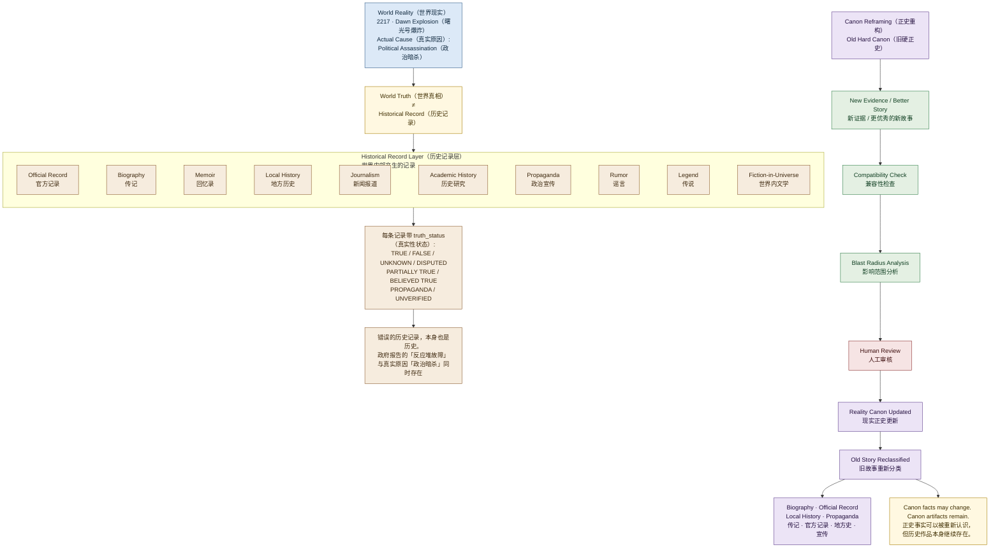

# 03 · Historical Layers（历史分层图）

> 对应架构版本：仓库当前文档 v0.2 Draft。图中所有系统均为 **Architecture Direction（架构方向）**，不代表已经实现。

## 图用途（Purpose）

回答一个问题：

> **世界真实发生的事情，与世界里的人如何记录这些事情，有什么区别？**

这是 Living Universe（活宇宙）最有特色的一张图：World Reality（世界现实）与 Historical Record Layer（历史记录层）严格分离——同一个事件可以同时存在一条"真实原因"和一条"官方说法"，两者都属于这个世界。

## Mermaid Diagram

## 简短解释（Short Explanation）

- **上部：两个层次。** World Reality（世界现实）保存"当前认定真正发生过的事情"；Historical Record Layer（历史记录层）保存"世界内部产生的记录"——官方记录、传记、回忆录、地方历史、新闻报道、学术历史研究、政治宣传、谣言、传说、世界内文学。
- **中间的「≠」是核心。** World Truth（世界真相）不等于 Historical Record（历史记录）。示例：2217 年 Dawn（曙光号）爆炸的真实原因是 Political Assassination（政治暗杀），而政府报告宣称 Reactor Failure（反应堆故障）——两者同时存在，互不冲突。
- **Epistemic Layer（认知层）** 为每条记录标记 truth_status（真实性状态）：真实、错误、未知、争议、部分真实、被认为真实、宣传性内容、未验证。认知状态不改变 World Reality 本身。
- **下部：Canon Reframing（正史重构）**。当新证据或更好的新故事出现时：旧硬正史 → 新证据 → 兼容性检查 → 影响范围分析 → 人工审核 → 现实正史更新 → 旧故事重新分类（成为传记 / 官方记录 / 地方史 / 宣传等）。
- **重要：旧故事不会被删除。** 它只是从 Reality Canon（现实正史）移入 Historical Record Layer（历史记录层），意义发生改变。

## 对应架构文档（Related Architecture Docs）

- [docs/architecture/world-reality.md](../architecture/world-reality.md) — 2217 Dawn（曙光号）示例
- [docs/architecture/historical-record-layer.md](../architecture/historical-record-layer.md)
- [docs/architecture/epistemic-layer.md](../architecture/epistemic-layer.md)
- [docs/architecture/canon-reframing.md](../architecture/canon-reframing.md)
- [docs/architecture/blast-radius.md](../architecture/blast-radius.md)
- [docs/architecture/provenance-graph.md](../architecture/provenance-graph.md)
