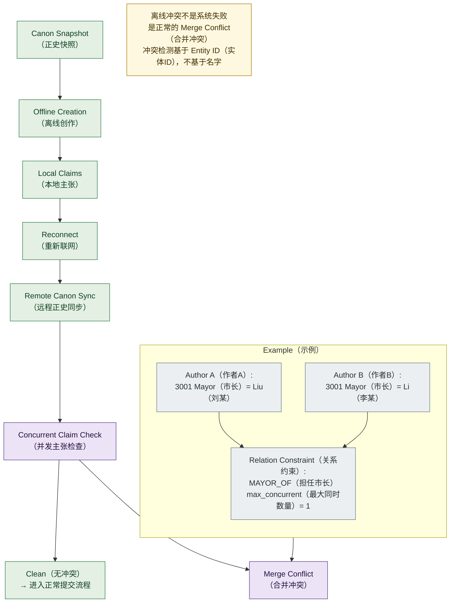

# 08 · Offline Merge Flow（离线创作与合并流程图）

> 对应架构版本：仓库当前文档 v0.2 Draft。图中所有系统均为 **Architecture Direction（架构方向）**，不代表已经实现。

## 图用途（Purpose）

回答一个问题：

> **多个创作者离线创作、重新联网后，并发主张如何处理？**

这张图展示多人并发场景：离线冲突不是系统失败，而是正常的 **Merge Conflict（合并冲突）**，由关系约束（Relation Constraint）检测并交由人工处理。

## Mermaid Diagram

## 简短解释（Short Explanation）

1. 创作者先获取 **Canon Snapshot（正史快照）**——按时间、地点、范围生成的正史摘要，也是离线创作的基线（baseline）。
2. **Offline Creation（离线创作）**：在本地创作，产出 **Local Claims（本地主张）**，不依赖网络。
3. **Reconnect（重新联网）** 后执行 **Remote Canon Sync（远程正史同步）**，把本地主张与远程正史对齐。
4. **Concurrent Claim Check（并发主张检查）**：检测多个创作者对同一 Subject（主体）/ Relation（关系）/ 时间区间提出不同主张的情况。
5. 结果分为两条路径：**Clean（无冲突）** → 进入正常提交流程；**Merge Conflict（合并冲突）** → 交由人工解决。
6. **示例**：作者 A 提出"3001 年市长 = 刘某"，作者 B 提出"3001 年市长 = 李某"。关系约束 `MAYOR_OF（担任市长）max_concurrent = 1` 被违反 → 系统输出 Merge Conflict（合并冲突），而不是两个故事同时进入正史。
7. **记住**：离线冲突不是系统失败，而是正常的合并冲突；冲突检测基于 Entity ID（实体ID），不基于名字。

## 对应架构文档（Related Architecture Docs）

- [docs/architecture/merge-protocol.md](../architecture/merge-protocol.md) — 离线同步流程、关系约束、示例
- [docs/architecture/canon-snapshot.md](../architecture/canon-snapshot.md) — 快照是离线创作的基线
- [docs/architecture/claim-layer.md](../architecture/claim-layer.md) — 冲突发生在 Claim（事实主张）层
- [docs/architecture/canon-engine.md](../architecture/canon-engine.md) — Concurrent Claim Detector 与 Relation Constraints
- [docs/architecture/identity-system.md](../architecture/identity-system.md) — 基于实体 ID 的冲突检测
