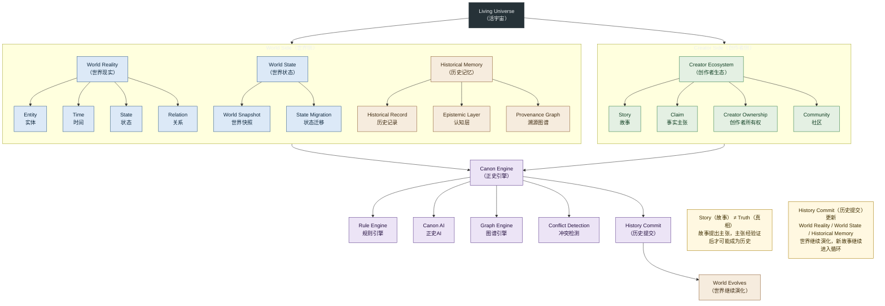

# 01 · System Landscape（系统全景图）

> 对应架构版本：仓库当前文档 v0.2 Draft。图中所有系统均为 **Architecture Direction（架构方向）**，不代表已经实现。

## 图用途（Purpose）

回答一个问题：

> **Living Universe（活宇宙）到底由哪些系统构成？**

这张图是进入仓库的第一张图：世界侧（World Reality 世界现实、World State 世界状态、Historical Memory 历史记忆）、创作者侧（Creator Ecosystem 创作者生态）、验证引擎（Canon Engine 正史引擎）、提交与演化闭环（History Commit 历史提交 → World Evolves 世界继续演化）。

新人 30 秒读懂主链路：

> **创作者写故事 → 系统提取事实 → 正史引擎检查 → 人类决定 → 历史进入世界。**

## Mermaid Diagram

## 简短解释（Short Explanation）

- **Living Universe（活宇宙）** 的五个最高层核心概念是：World Reality（世界现实）、World State（世界状态）、Historical Memory（历史记忆）、Creator Ecosystem（创作者生态）、Canon Engine（正史引擎）。
- **World Reality（世界现实）** 是当前认定真正发生过的事情；**World State（世界状态）** 是某一时间点世界的可计算状态（快照与迁移）。两者都是「世界侧」，但不是同一个概念。
- **Historical Memory（历史记忆）** 是 Historical Record Layer（历史记录层）、Epistemic Layer（认知层）与 Provenance Graph（溯源图谱）的集合：世界不仅保存事实，也保存关于事实的记录、理解与误解。
- **Creator Ecosystem（创作者生态）** 提供 Story（故事）与 Claim（事实主张）；创作者所有权（Creator Ownership）与社区（Community）在此层。
- **Canon Engine（正史引擎）** 验证事实主张与世界现实的兼容性，包含 Rule Engine（规则引擎）、Canon AI（正史AI）、Graph Engine（图谱引擎）与冲突检测（Conflict Detection）。
- **History Commit（历史提交）** 是故事正式成为历史的操作；它更新 World Reality、World State 与 Historical Memory，世界因此继续演化（循环）。
- 图中蓝色 = World Reality / World State（世界侧），暖色 = Historical Memory（记忆侧），绿色 = Creator Ecosystem（创作者侧），紫色 = Canon Engine（引擎侧）。颜色只用于分类，不做装饰。

## 对应架构文档（Related Architecture Docs）

- [docs/architecture/system-v0.2.md](../architecture/system-v0.2.md) — 五个最高层核心概念的定义
- [docs/architecture/world-reality.md](../architecture/world-reality.md)
- [docs/architecture/world-state.md](../architecture/world-state.md)
- [docs/architecture/historical-record-layer.md](../architecture/historical-record-layer.md)
- [docs/architecture/canon-engine.md](../architecture/canon-engine.md)
- [docs/governance/canon-levels.md](../governance/canon-levels.md)
- [docs/SYSTEM_OVERVIEW.md](../SYSTEM_OVERVIEW.md)
