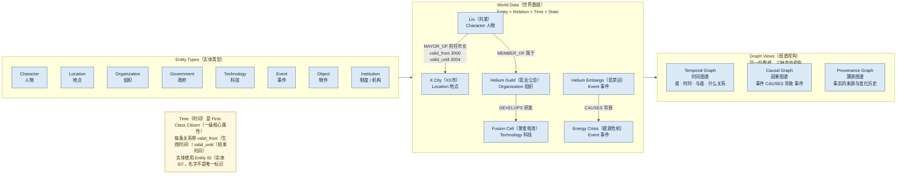

# 04 · World Data Graph（世界数据图）

> 对应架构版本：仓库当前文档 v0.2 Draft。图中所有系统均为 **Architecture Direction（架构方向）**，不代表已经实现。

## 图用途（Purpose）

回答一个问题：

> **Living Universe（活宇宙）的世界数据到底长什么样？**

这张图展示世界数据的核心结构：**Entity（实体）× Relation（关系）× Time（时间）× State（状态）**，以及同一份数据上的三种图谱视角（Temporal / Causal / Provenance）。

这张图必须突出：

> **Time（时间）是 First-Class Citizen（一级核心属性）。**

## Mermaid Diagram

## 简短解释（Short Explanation）

- **实体类型（Entity Types）**：Character（人物）、Location（地点）、Organization（组织）、Government（政府）、Technology（科技）、Event（事件）、Object（物件）、Institution（制度 / 机构）。
- **关系（Relation）是有类型的连接**，例如 `MAYOR_OF（担任市长）`、`DEVELOPS（研发）`、`CAUSES（导致）`、`MEMBER_OF（属于）`。
- **每条关系带时间**：`valid_from（生效时间）` 与 `valid_until（结束时间）`。因此"3000–3004 年刘某担任 XX 市市长"是可查询的事实，而不是一条没有时间的世界观条目。
- **三种图谱视角作用在同一份数据上**：
  - **Temporal Graph（时间图谱）**：回答"谁、在什么时间、与什么、处于什么关系"。
  - **Causal Graph（因果图谱）**：记录事件之间的 Cause（原因）/ Effect（结果），例如氦禁运 → 能源危机。
  - **Provenance Graph（溯源图谱）**：追踪每个重要事实的来源与变化历史（谁提出、何时进入正史、是否被重构）。
- **Identity System（身份系统）**：实体使用唯一 Entity ID（实体ID），同名角色可以共存；身份碰撞（Identity Collision）不自动合并，由人工审核决定。
- 上述所有图谱均为 Architecture Direction（架构方向），当前仓库仍以 Markdown 文档为主，不代表已经实现。

## 对应架构文档（Related Architecture Docs）

- [docs/architecture/temporal-knowledge-graph.md](../architecture/temporal-knowledge-graph.md) — Entity × Relation × Time × State
- [docs/architecture/causal-graph.md](../architecture/causal-graph.md)
- [docs/architecture/provenance-graph.md](../architecture/provenance-graph.md)
- [docs/architecture/identity-system.md](../architecture/identity-system.md)
- [docs/architecture/claim-layer.md](../architecture/claim-layer.md) — Claim 是 TKG 的候选边
- [docs/architecture/world-state.md](../architecture/world-state.md) — World Snapshot（世界快照）
